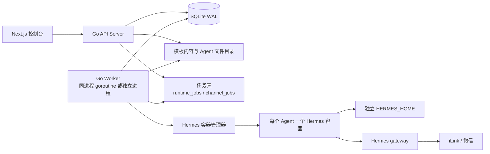
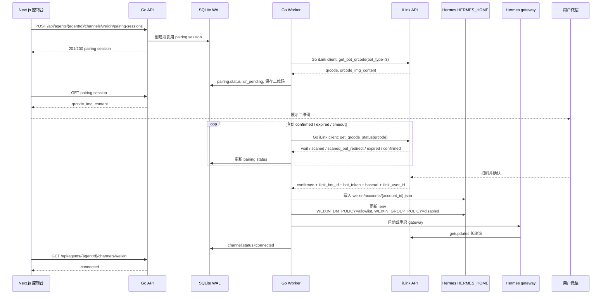
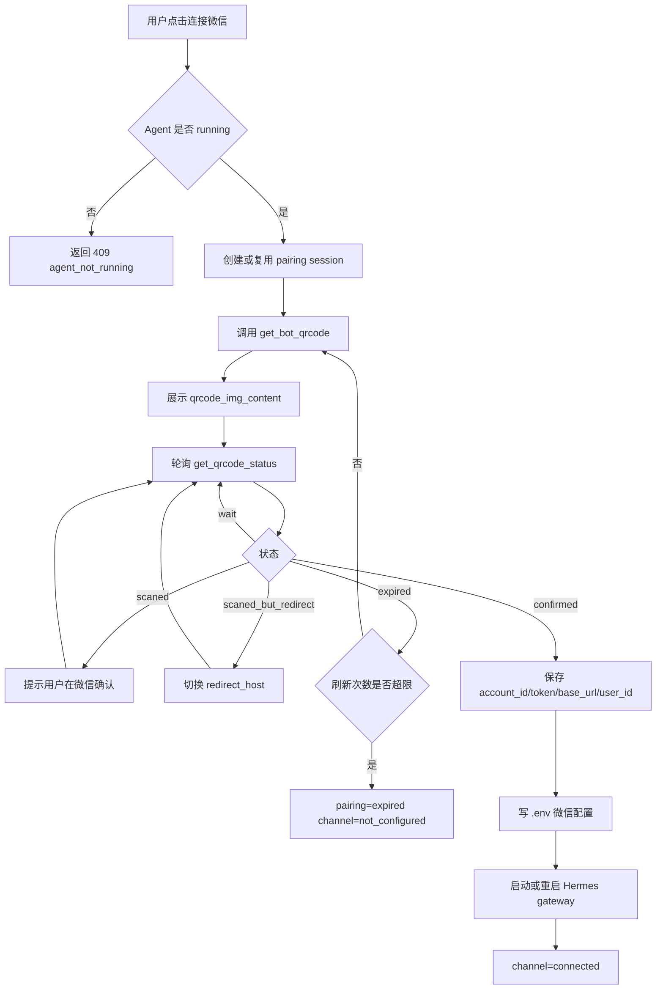

# AgentForge MVP 设计规格

日期：2026-06-12

## 摘要

AgentForge MVP 提供一个完整闭环：用户从管理员维护的 Agent 模板创建自己的 Agent，等待 Hermes 运行时启动成功，然后通过微信扫码连接该 Agent，并在微信中与 Agent 聊天。

MVP 明确不包含普通用户上传 skills、普通用户编辑 `SOUL.md` 或 `USER.md`、团队空间、模板市场，以及 QQ、Telegram、WeCom 等其他渠道。这些能力可以在 Hermes + 微信运行链路稳定后再加入。

## 已确认范围

- 前端使用 Next.js。
- 后端使用 Go。
- 元数据数据库使用 SQLite，并开启 WAL。
- Agent 运行时复用 Hermes。
- 每个用户创建的 Agent 都有独立 Hermes 容器和独立 `HERMES_HOME`。
- 第一版通讯渠道是个人微信扫码登录。
- 平台是轻量多用户产品。
- 只有管理员可以创建和发布 Agent 模板。
- 普通用户只能基于已发布模板创建 Agent。
- 普通用户不能编辑模板提供的 `SOUL.md`、`USER.md` 或 skills。
- 普通用户在 MVP 中不能上传或选择自定义 skills。
- 管理员不需要上传模板包；管理员在平台内维护模板的 `SOUL.md`、`USER.md` 和 skills。
- 渠道配置只能在 Agent 运行时启动成功后开放。

## Hermes 约束

Hermes 官方文档说明了以下能力：

- `SOUL.md` 用于人格配置。
- `USER.md` 和记忆相关文件用于持久用户上下文。
- skills 系统基于 skill 目录和 `SKILL.md`。
- 消息网关支持 Weixin、WeCom、QQ Bot、Telegram 等平台。
- `config.yaml` 是 Hermes 主配置文件。MVP 中模型 provider 配置直接写入 `config.yaml`，微信账号与渠道策略配置写入 `.env`。
- `hermes gateway setup` 是面向人工操作的交互式向导，不适合作为平台后端的主集成方式。
- gateway 运行时由平台适配器接收消息，通过聊天会话路由，并分发给 Agent 处理。

AgentForge 应把 Hermes 作为运行时边界。Go 后端负责生命周期、文件系统准备、`config.yaml` 和 `.env` 生成、容器操作和状态跟踪；Hermes 进程负责真实 Agent 执行、gateway 运行和聊天处理。

## 架构

系统分为三个主要边界。

### Next.js 控制台

控制台提供：

- 登录和会话 UI。
- 普通用户可见的模板列表。
- 基于模板创建 Agent。
- Agent 列表和详情页。
- 运行时状态展示。
- 微信渠道配置页。
- 二维码展示和连接状态。
- 管理员模板管理页面。

控制台不直接操作 Hermes 文件或容器。所有运行时动作都通过 Go API 完成。

### Go API 与 Worker

Go 后端提供：

- 认证和授权。
- `admin` 与 `user` 的角色权限控制。
- 开启 WAL 的 SQLite 持久化。
- 模板元数据和版本管理。
- Agent 实例创建。
- Hermes home 目录准备。
- Hermes 容器生命周期管理。
- 微信渠道配置编排。
- 运行时和渠道状态同步。
- 创建、启动和排障事件日志。

这里的 Worker 指 Go 后端里的后台任务执行器，不是一个前端概念，也不是独立产品模块。第一版可以把 API server 和 worker 放在同一个 Go 进程中运行，通过 goroutine 消费 `runtime_jobs` 和 `channel_jobs` 两张任务表；部署成熟后可以拆成独立 worker 进程。API 请求只负责创建记录、校验权限、写入任务并返回当前资源状态；容器创建、Hermes home 生成、gateway 启动、微信二维码轮询等耗时操作由 worker 异步推进。

推荐第一版架构：



任务表是 API 与 worker 的边界。`runtime_jobs` 负责 Agent 运行时生命周期任务，`channel_jobs` 负责微信连接、重连、断开等渠道任务。API 不直接等待任务完成；前端通过资源状态接口轮询或通过 SSE 接收状态变化。

### 服务结构与代码组织

第一版建议使用简化 monorepo，前端、后端和运行时数据目录在根目录分开：

```text
AgentForge/
├── web/                              # Next.js 控制台
│   ├── app/
│   ├── components/
│   ├── lib/api/
│   └── tests/
├── services/
│   └── api/                         # Go 后端
│       ├── cmd/
│       │   └── agentforge-api/       # API server 入口；第一版同时启动 worker goroutine
│       ├── internal/
│       │   ├── auth/                 # session、密码、RBAC
│       │   ├── http/                 # REST handler、middleware、router
│       │   ├── templates/            # SOUL.md、USER.md、skills 模板管理
│       │   ├── agents/               # Agent 创建、状态机、查询
│       │   ├── channels/             # channel 聚合逻辑
│       │   ├── weixin/               # Go iLink client、二维码状态轮询、凭据持久化
│       │   ├── runtime/              # Hermes home 生成、容器管理、gateway 启停
│       │   ├── jobs/                 # runtime_jobs/channel_jobs claim、执行、重试
│       │   ├── db/                   # SQLite 连接、迁移、repository
│       │   └── config/               # 服务端配置
│       ├── migrations/
│       ├── .env.example              # 后端服务自身配置示例
│       └── tests/
├── var/                              # 本地开发默认数据根目录；生产可挂载到数据盘
│   ├── agentforge.db                 # SQLite WAL 数据库
│   ├── templates/                    # 管理员维护的模板内容
│   ├── agents/                       # 每个 Agent 的 HERMES_HOME
│   └── logs/
└── docs/
```

`web/` 放在根目录的原因是：MVP 只有一个 Next.js 控制台，没有多前端应用并存的需求。直接使用 `web/` 更短，也更符合当前规模。Go 后端仍放在 `services/api`，避免前端代码和 Go module、数据库迁移、运行时管理代码混在一起。

### 后端服务自身配置

Go 后端服务可以从 `services/api/.env` 读取自身配置，方便本地开发和部署时注入环境差异。这个 `.env` 属于 AgentForge 后端服务，不是每个 Hermes Agent 的 `$HERMES_HOME/.env`。

建议提供 `services/api/.env.example`，本地开发复制为 `services/api/.env`：

```dotenv
AGENTFORGE_HTTP_ADDR=:8080
AGENTFORGE_PUBLIC_BASE_URL=http://localhost:8080
AGENTFORGE_DATA_DIR=../../var
AGENTFORGE_SESSION_SECRET=dev-change-me
AGENTFORGE_HERMES_IMAGE=nousresearch/hermes-agent:v2026.6.5
AGENTFORGE_HERMES_MEMORY=500m
AGENTFORGE_HERMES_CPUS=0.5
```

后端服务 `.env` 只保留开发和生产可能不同的配置，例如 API 监听地址、外部访问地址、数据目录、session secret、Hermes 镜像版本和容器资源限制。`AGENTFORGE_SQLITE_PATH` 不需要单独配置，默认由 `AGENTFORGE_DATA_DIR/agentforge.db` 推导；Docker 二进制默认使用 `docker`；worker 第一版默认随 API 进程启动。每个 Agent 的 Hermes 配置仍由后端生成到 `var/agents/{agent_id}/hermes-home/config.yaml` 和 `var/agents/{agent_id}/hermes-home/.env`。

运行时存储目录由 Go 后端统一管理，数据库只保存路径、版本和校验值，不把大文件塞进 SQLite：

```text
var/
├── agentforge.db
├── agentforge.db-wal
├── agentforge.db-shm
├── templates/
│   └── {template_id}/
│       └── versions/
│           └── {version}/
│               ├── SOUL.md
│               ├── USER.md
│               └── skills/
│                   └── {skill_name}/
│                       ├── SKILL.md
│                       └── ...
└── agents/
    └── {agent_id}/
        └── hermes-home/
            ├── config.yaml
            ├── .env
            ├── SOUL.md
            ├── memories/
            │   └── USER.md
            ├── skills/
            ├── sessions/
            ├── logs/
            └── weixin/
                └── accounts/
                    └── {account_id}.json
```

### Hermes 运行时

每个 Agent 对应一个独立 Hermes 容器。容器接收：

- 专用 `HERMES_HOME`。
- 模板提供的 `SOUL.md`、`USER.md` 和 skills。
- 模型或 provider 访问所需的运行时配置。
- 用户启动微信渠道配置后生成的 gateway 配置。

平台不能在不同 Agent 或不同用户之间共享 Hermes home 目录。

Hermes 容器中的数据必须挂载到宿主机，不能只保存在容器层。每个 Agent 的宿主机目录 `var/agents/{agent_id}/hermes-home` 是该 Agent 的权威数据目录，容器内挂载到 `/opt/data`。容器删除、重建、镜像升级后，`SOUL.md`、`USER.md`、skills、sessions、logs、微信账号凭据和 gateway 状态都必须保留。

容器启动命令使用参数化模板：

```bash
docker run -d \
  --name {container_name} \
  --restart unless-stopped \
  -v {host_hermes_home}:/opt/data \
  -e HERMES_HOME=/opt/data \
  --memory={memory_limit} \
  --cpus={cpu_limit} \
  {hermes_image} \
  gateway run
```

MVP 默认值：

- `{container_name}`：`agentforge-hermes-{agent_id}`
- `{host_hermes_home}`：宿主机绝对路径，例如 `/srv/agentforge/agents/{agent_id}/hermes-home`
- `{memory_limit}`：`500m`
- `{cpu_limit}`：`0.5`
- `{hermes_image}`：`nousresearch/hermes-agent:v2026.6.5`

`--name` 和 `-v` 必须按 Agent 实例动态生成，不能写死为 `hermes` 或 `~/.hermes:/opt/data`。生产环境应使用绝对路径，避免 `~` 在不同启动用户下解析不一致。`HERMES_HOME=/opt/data` 是强制要求，确保 Hermes 读写都落在宿主机挂载目录，而不是容器默认 home 或 writable layer。

## Hermes 配置策略

平台后端不直接驱动 `hermes gateway setup`。该命令是交互式向导，适合人工初始化和排障，但不适合稳定的后台编排。

MVP 采用文件生成方式配置 Hermes：

- Worker 为每个 Agent 创建独立 `HERMES_HOME`。
- Worker 将模板中的 `SOUL.md`、`USER.md` 和 skills 复制到该目录。
- Worker 生成或合并 `$HERMES_HOME/config.yaml`，写入模型、provider、terminal、display 等通用 Hermes 配置。
- Worker 生成或更新 `$HERMES_HOME/.env`，写入 Weixin 适配器凭据和 Weixin 策略配置。
- Worker 启动或重启该 Agent 的 Hermes gateway 进程。
- 对于微信扫码，Worker 使用 Go 原生 iLink client 实现 Hermes `gateway/platforms/weixin.py` 中 `qr_login()` 的等价流程，通过 iLink `get_bot_qrcode` 和 `get_qrcode_status` 获取二维码与扫码状态，并同步到 `channel_pairing_sessions`。后端不调用 Python 脚本，也不把 Hermes Python 代码当作子进程来跑。
- 生成 Weixin 配置时，不在 `config.yaml` 中写 `gateway.platforms.weixin` 片段；微信相关配置直接写入 `.env`。默认私信策略为 `allowlist`，默认群组策略为 `disabled`。平台只允许绑定该 Agent 的平台用户访问对应微信 Agent；群聊默认关闭。

目标 `config.yaml` 模型配置片段：

```yaml
model:
  default: deepseek-v4-flash
  provider: custom
  base_url: https://api.deepseek.com
  api_key: xxx
  api_mode: chat_completions
```

`api_key` 由服务端写入 Agent 的宿主机 `hermes-home/config.yaml`，不能返回前端，也不能写入用户可见日志。后续可以将 `api_key` 替换为服务端密钥引用或环境变量引用，但 MVP 按上面的 Hermes 配置结构落地。

`hermes gateway setup` 只作为人工排障路径保留，不进入 MVP 的正常后台任务链路。

## 数据模型

### `users`

保存账号身份和角色。

重要字段：

- `id`
- `email`
- `password_hash` 或外部认证 subject
- `role`：`admin` 或 `user`
- `created_at`
- `updated_at`

### `agent_templates`

保存管理员维护的模板元数据。

重要字段：

- `id`
- `name`
- `description`
- `status`：`draft`、`published`、`archived`
- `version`
- `template_path`
- `content_checksum`
- `soul_md_path`
- `user_md_path`
- `skills_path`
- `created_by`
- `created_at`
- `updated_at`
- `published_at`

管理员在平台内编辑模板的 `SOUL.md`、`USER.md` 和 skills；后端将这些内容保存到受控模板目录。已发布模板应保持不可变。编辑已发布模板时创建新版本，保证已有 Agent 可复现。

### `template_skills`

保存模板包含的 skills。

重要字段：

- `id`
- `template_id`
- `skill_name`
- `skill_path`
- `checksum`
- `created_at`

只有管理员可以通过模板管理流程修改这张表。

### `agents`

保存用户创建的 Agent 实例。

重要字段：

- `id`
- `owner_user_id`
- `template_id`
- `template_version`
- `name`
- `status`：`creating`、`provisioning`、`starting`、`running`、`stopped`、`error`
- `runtime_id`
- `hermes_home_path`
- `last_error_code`
- `last_error_message`
- `created_at`
- `updated_at`

### `agent_runtime_events`

保存运行时生命周期事件。

重要字段：

- `id`
- `agent_id`
- `event_type`
- `status_before`
- `status_after`
- `message`
- `metadata_json`
- `created_at`

这张表用于支持排障、调试和面向用户的摘要日志。

### `agent_channels`

保存渠道配置和状态。

重要字段：

- `id`
- `agent_id`
- `channel_type`：MVP 中为 `weixin`
- `status`：`not_configured`、`qr_pending`、`connected`、`error`、`disconnected`
- `external_account_id`
- `last_error_code`
- `last_error_message`
- `created_at`
- `updated_at`

### `channel_pairing_sessions`

保存二维码配对会话。

重要字段：

- `id`
- `agent_channel_id`
- `status`：`pending`、`connected`、`expired`、`failed`
- `qr_payload`
- `qr_image_path`
- `expires_at`
- `attempt_count`
- `last_error_code`
- `last_error_message`
- `created_at`
- `updated_at`

二维码内容和图片路径可以返回前端。provider key、gateway token、微信凭据和 Hermes secret 不能返回前端。

### `runtime_jobs`

保存 Agent 运行时生命周期任务，是 API 与 worker 的异步边界。

重要字段：

- `id`
- `agent_id`
- `type`：`provision_agent`、`start_runtime`、`stop_runtime`、`restart_runtime`
- `status`：`queued`、`running`、`succeeded`、`failed`、`cancelled`
- `priority`
- `attempt_count`
- `max_attempts`
- `locked_by`
- `locked_until`
- `idempotency_key`
- `payload_json`
- `result_json`
- `last_error_code`
- `last_error_message`
- `created_at`
- `updated_at`
- `started_at`
- `finished_at`

同一 Agent 同一时间只能有一个 `queued` 或 `running` 的 runtime job。worker 使用事务 claim job，并设置 `locked_by/locked_until`，避免多 worker 重复执行。

### `channel_jobs`

保存渠道连接和断开任务。MVP 中只用于微信。

重要字段：

- `id`
- `agent_channel_id`
- `pairing_session_id`
- `type`：`connect_weixin`、`disconnect_weixin`、`refresh_weixin_pairing`
- `status`：`queued`、`running`、`succeeded`、`failed`、`cancelled`
- `priority`
- `attempt_count`
- `max_attempts`
- `locked_by`
- `locked_until`
- `idempotency_key`
- `payload_json`
- `result_json`
- `last_error_code`
- `last_error_message`
- `created_at`
- `updated_at`
- `started_at`
- `finished_at`

同一 `agent_channel_id` 同一时间只能有一个活跃 channel job。同一微信渠道同一时间只能有一个未过期 pairing session。

## 状态机

### Agent 运行时

正常流转：

```text
creating -> provisioning -> starting -> running
```

失败和恢复流转：

```text
creating -> error
provisioning -> error
starting -> error
running -> stopped
running -> error
stopped -> starting
error -> provisioning
error -> starting
```

重试从哪个阶段恢复取决于失败阶段。后端通过 `last_error_code` 和 `agent_runtime_events` 记录失败阶段。

### 微信渠道

正常流转：

```text
not_configured -> qr_pending -> connected
```

失败和恢复流转：

```text
qr_pending -> error
qr_pending -> not_configured
connected -> disconnected
disconnected -> qr_pending
error -> qr_pending
```

如果 Agent 不是 `running`，API 必须拒绝渠道配置请求。

## 用户流程

### 管理员模板流程

1. 管理员登录。
2. 管理员创建草稿 Agent 模板。
3. 管理员在平台内编辑模板的 `SOUL.md`。
4. 管理员在平台内编辑模板的 `USER.md`。
5. 管理员在平台内维护模板 skills，包括新增 skill、编辑 `SKILL.md`、编辑 skill 目录内的必要文件、删除 skill。
6. 后端校验必需文件和 skill 结构。
7. 管理员发布模板。
8. 已发布模板出现在普通用户模板列表中。

### 普通用户创建 Agent 流程

1. 用户登录。
2. 用户查看已发布模板。
3. 用户选择模板并输入 Agent 名称。
4. API 创建 `agents` 记录，状态为 `creating`。
5. API 创建一个 `runtime_jobs` 资源，类型为 `provision_agent`。
6. Worker 将模板中的 `SOUL.md`、`USER.md` 和 skills 复制到新的 `HERMES_HOME`。
7. Worker 创建 Hermes 容器。
8. Worker 启动容器。
9. Agent 状态变为 `running`。
10. 控制台开放微信配置入口。

### 微信配置流程

1. 用户打开 Agent 详情页。
2. 控制台确认 Agent 状态为 `running`。
3. 用户启动微信配置。
4. API 创建或复用有效的 `channel_pairing_sessions` 资源。
5. Worker 调用与 `weixin.py` 中 `qr_login()` 等价的非交互逻辑，向 iLink 获取二维码。
6. 后端保存 `qrcode`、`qrcode_img_content`、过期时间和当前状态。
7. 控制台展示二维码。
8. Worker 轮询 iLink 二维码状态。
9. 用户用微信扫码。
10. iLink 返回 `scaned` 时，控制台提示用户在微信内确认。
11. iLink 返回 `confirmed` 时，Worker 取得 `ilink_bot_id`、`bot_token`、`baseurl`、`ilink_user_id`。
12. Worker 将账号凭据保存到 `$HERMES_HOME/weixin/accounts/{account_id}.json`。
13. Worker 更新该 Agent 的 `.env`，写入微信渠道配置。
14. Worker 启动或重启该 Agent 的 Hermes gateway。
15. 渠道状态变为 `connected`。
16. 用户在微信中与 Agent 聊天。

### 微信接入详细流程图

参考实现：`https://github.com/NousResearch/hermes-agent/blob/main/gateway/platforms/weixin.py`

Hermes `weixin.py` 的关键行为：

- `qr_login()` 调用 iLink `get_bot_qrcode` 获取 `qrcode` 和 `qrcode_img_content`。
- `qr_login()` 轮询 iLink `get_qrcode_status`。
- 状态为 `wait` 时继续等待。
- 状态为 `scaned` 时表示已扫码，等待用户在微信内确认。
- 状态为 `scaned_but_redirect` 时切换到返回的 `redirect_host` 继续轮询。
- 状态为 `expired` 时刷新二维码；多次过期后失败。
- 状态为 `confirmed` 时取得 `ilink_bot_id`、`bot_token`、`baseurl`、`ilink_user_id`，并保存为 Hermes 微信账号凭据。
- `WeixinAdapter` 启动时从 `platforms.weixin.token`、`platforms.weixin.extra.account_id/base_url` 或 `WEIXIN_*` 环境变量读取配置；如果只有 `account_id` 没有 token，会尝试从 `$HERMES_HOME/weixin/accounts/{account_id}.json` 读取 token。

AgentForge 的实现方式：

- Go 后端在 `internal/weixin` 中实现 iLink client，不调用 Hermes 的 Python 脚本。
- Go iLink client 复刻 `qr_login()` 需要的 HTTP 行为：请求 `get_bot_qrcode`、轮询 `get_qrcode_status`、处理 `wait`、`scaned`、`scaned_but_redirect`、`expired`、`confirmed`。
- 扫码确认后，Go 后端将 `account_id`、`token`、`base_url`、`user_id` 按 Hermes 兼容格式写入 `$HERMES_HOME/weixin/accounts/{account_id}.json`。
- Go 后端生成 `$HERMES_HOME/.env` 时写入 `WEIXIN_ACCOUNT_ID`、`WEIXIN_TOKEN`、`WEIXIN_BASE_URL`、`WEIXIN_DM_POLICY`、`WEIXIN_GROUP_POLICY`、`WEIXIN_ALLOWED_USERS`、`WEIXIN_GROUP_ALLOWED_USERS` 等配置。
- 默认 `dm_policy=allowlist`，`group_policy=disabled`。MVP 约定扫码确认的微信用户就是后续给 Agent 发送私信的微信用户，因此 `WEIXIN_ALLOWED_USERS` 初始写入扫码确认后得到的 `ilink_user_id`。后续如需授权更多微信私信用户，通过平台授权流程追加。

目标 `.env` 片段：

```dotenv
WEIXIN_ACCOUNT_ID={account_id}
WEIXIN_TOKEN={bot_token}
WEIXIN_BASE_URL={base_url}
WEIXIN_DM_POLICY=allowlist
WEIXIN_GROUP_POLICY=disabled
WEIXIN_ALLOWED_USERS={allowed_weixin_user_ids_csv}
WEIXIN_GROUP_ALLOWED_USERS=
```

`WEIXIN_ALLOWED_USERS` 使用逗号分隔的微信用户 ID。MVP 默认只写入扫码确认后得到的 `ilink_user_id`；后续如需授权更多私信用户，通过平台授权流程更新该 Agent 的 `.env` 并重启 gateway。群聊默认禁用，因此 `WEIXIN_GROUP_ALLOWED_USERS` 为空。





## API 设计

API 必须遵循 RESTful 资源设计：URL 表示资源，HTTP 方法表示资源操作，避免 `/start`、`/stop`、`/retry`、`/setup`、`/publish` 这类动词式路径。会产生异步副作用的操作用 job 资源或子资源表达。

### 会话

- `POST /api/sessions`
- `GET /api/session`
- `DELETE /api/session`

### 模板

- `GET /api/templates`
- `GET /api/templates/{id}`
- `POST /api/admin/templates`
- `PUT /api/admin/templates/{id}`
- `DELETE /api/admin/templates/{id}`
- `GET /api/admin/templates/{id}/soul`
- `PUT /api/admin/templates/{id}/soul`
- `GET /api/admin/templates/{id}/user`
- `PUT /api/admin/templates/{id}/user`
- `GET /api/admin/templates/{id}/skills`
- `POST /api/admin/templates/{id}/skills`
- `GET /api/admin/templates/{id}/skills/{skillId}`
- `PUT /api/admin/templates/{id}/skills/{skillId}`
- `DELETE /api/admin/templates/{id}/skills/{skillId}`
- `PUT /api/admin/templates/{id}/publication`
- `DELETE /api/admin/templates/{id}/publication`

### Agents

- `POST /api/agents`
- `GET /api/agents`
- `GET /api/agents/{id}`
- `GET /api/agents/{id}/runtime`
- `GET /api/agents/{id}/runtime-jobs`
- `POST /api/agents/{id}/runtime-jobs`
- `GET /api/agents/{id}/runtime-jobs/{jobId}`

### 微信渠道

- `GET /api/agents/{id}/channels/weixin`
- `PUT /api/agents/{id}/channels/weixin`
- `DELETE /api/agents/{id}/channels/weixin`
- `GET /api/agents/{id}/channels/weixin/pairing-sessions`
- `POST /api/agents/{id}/channels/weixin/pairing-sessions`
- `GET /api/agents/{id}/channels/weixin/pairing-sessions/{sessionId}`

模板 skill 不支持文件级编辑。`POST /api/admin/templates/{id}/skills` 创建一个完整 skill，`PUT /api/admin/templates/{id}/skills/{skillId}` 整体替换该 skill 的 `SKILL.md` 和目录内容，`DELETE` 删除整个 skill。

Agent runtime 资源只读。`GET /api/agents/{id}/runtime` 返回当前容器、挂载、镜像、状态和最近错误。启动、停止、重启和重新 provision 都通过 `POST /api/agents/{id}/runtime-jobs` 创建 job 表达，避免在 `PUT /runtime` 上混合多种动作语义。

渠道和 job 接口返回当前资源状态，不阻塞等待用户扫码完成。

## 后台任务

### `ProvisionAgent`

职责：

- 获取 Agent 级运行时锁。
- 将 Agent 状态从 `creating` 推进到 `provisioning`。
- 创建 Agent 的 `HERMES_HOME`。
- 复制模板文件和 skills。
- 写入 Hermes 配置。
- 创建 Hermes 容器。
- 启动 Hermes 容器。
- 将 Agent 状态推进到 `running`。
- 在每个主要步骤记录事件。

任务必须幂等。重复执行时应识别已有文件系统和容器状态，并从最后一个安全点继续。

该任务由 `POST /api/agents/{id}/runtime-jobs` 创建。请求体中的 `type` 为 `provision_agent` 或 `restart_runtime`。

### `ConnectWeixinChannel`

职责：

- 校验 Agent 为 `running`。
- 获取 Agent 渠道锁。
- 创建或复用未过期的配对会话。
- 使用 Go iLink client 调用 iLink `get_bot_qrcode` 获取二维码；不能调用 Hermes Python 脚本。
- 将渠道状态更新为 `qr_pending`。
- 使用 Go iLink client 轮询 iLink `get_qrcode_status`。
- 在 `scaned` 时更新 pairing session，提示用户在微信内确认。
- 在 `scaned_but_redirect` 时切换 `redirect_host` 继续轮询。
- 在 `expired` 时刷新二维码或将 pairing session 标记为过期。
- 在 `confirmed` 时保存 `account_id`、`token`、`base_url`、`user_id` 到 `$HERMES_HOME/weixin/accounts/{account_id}.json`。
- 生成或更新该 Agent 的 `$HERMES_HOME/.env`。
- 写入 Weixin 默认安全策略：`WEIXIN_DM_POLICY=allowlist`、`WEIXIN_GROUP_POLICY=disabled`。
- 启动、重启或重载该 Agent 的 Hermes gateway。
- 将渠道状态更新为 `connected`、`not_configured` 或 `error`。

该任务由 `POST /api/agents/{id}/channels/weixin/pairing-sessions` 隐式创建。重复创建 pairing session 时，应返回当前未过期的配对会话，不能创建互相竞争的二维码会话。

## 并发控制

SQLite 必须启用 WAL 模式和 busy timeout。

后端必须阻止同一 Agent 的运行时操作并发执行。例如：

- 同一 Agent 同一时间只能有一个活跃 runtime job。
- `provision_agent`、`start_runtime`、`stop_runtime`、`restart_runtime` 不能并发执行。
- 同一 Agent 同一时间只能存在一个活跃微信 pairing session。
- 微信连接任务和渠道删除不能同时执行。

实现方式可以是数据库锁表，也可以是事务化任务状态检查。实现计划应选择第一版里最简单可靠的方案。

## 安全

授权规则：

- 管理员可以管理模板。
- 普通用户只能查看已发布模板。
- 普通用户只能为自己创建 Agent。
- 普通用户只能访问自己的 Agent、渠道和面向用户的事件摘要。
- 普通用户不能修改模板文件或 skills。

运行时隔离：

- 每个 Hermes 容器只挂载自己的 `HERMES_HOME`。
- 每个 Hermes 容器必须将宿主机 `var/agents/{agent_id}/hermes-home` 挂载到容器 `/opt/data`，不能把 Agent 数据只保存在容器 writable layer 中。
- 删除、重建或升级容器时不能删除宿主机 `hermes-home` 目录。
- 容器不能挂载共享用户 home 目录。
- 容器名称、路径和 runtime ID 应基于内部 ID 生成，不能直接使用用户输入。

密钥处理：

- provider API key、微信凭据、gateway token 和 Hermes secret 只能保存在服务端。
- MVP 中 provider API key 写入每个 Agent 的 `$HERMES_HOME/config.yaml`，微信凭据和渠道策略写入 `$HERMES_HOME/.env`。
- 密钥不能出现在 API 响应、日志或前端状态中。
- 面向用户的错误只暴露简短摘要和稳定错误码。

## 错误处理

Agent 错误应记录失败阶段：

- `copy_template_failed`
- `config_write_failed`
- `container_create_failed`
- `container_start_failed`
- `container_healthcheck_failed`

微信错误应记录渠道相关原因：

- `agent_not_running`
- `qr_generation_failed`
- `qr_expired`
- `scan_rejected`
- `gateway_disconnected`
- `pairing_timeout`

Agent 创建失败不会创建已连接渠道。微信渠道失败不会删除或回滚 Agent。

## 测试策略

### 后端单元测试

覆盖：

- RBAC 规则。
- 模板发布规则。
- Agent 状态机流转。
- 微信渠道状态机流转。
- SQLite repository 行为。
- 运行时锁行为。

### 后台任务集成测试

默认使用 fake Hermes runner，而不使用真实容器。

覆盖：

- `ProvisionAgent` 成功。
- 模板复制失败。
- 容器启动失败。
- provision 失败后的重试。
- `ConnectWeixinChannel` 成功。
- 二维码过期。
- iLink 状态覆盖：`wait`、`scaned`、`scaned_but_redirect`、`expired`、`confirmed` 缺字段。
- 重复创建 pairing session 复用活跃配对会话。
- 容器删除重建后，宿主机 `hermes-home` 中的配置、sessions、weixin account 文件仍存在。

### 前端 E2E 测试

覆盖：

- 用户登录。
- 用户选择已发布模板。
- 用户创建 Agent。
- Agent 推进到 `running`。
- 微信连接入口只在 `running` 后可用。
- 用户看到二维码。
- 模拟配对后状态变为 `connected`。

### 手动或可选外部测试

真实 Hermes + 微信扫码登录应作为可选测试，通过环境变量和手动账号可用性控制。它不应进入默认 CI。

## MVP 后续事项

- 普通用户上传 skills。
- 模板变量，替代用户直接编辑 `SOUL.md` 或 `USER.md`。
- QQ、Telegram、WeCom 和其他渠道。
- 模板市场和评分。
- 组织或团队支持。
- Agent 分享。
- 运行时指标和成本跟踪。
- 如果 Hermes 当前 Weixin 适配器没有稳定二维码状态输出，需要补充一个非交互式二维码状态接口或轻量 wrapper。

## 验收标准

- 管理员可以创建并发布 Agent 模板。
- 普通用户可以看到已发布模板。
- 普通用户可以基于模板创建 Agent。
- 后端为 Agent 创建专用 Hermes home。
- 后端为 Agent 启动专用 Hermes 容器。
- Hermes 容器使用 `-e HERMES_HOME=/opt/data`，并将宿主机 `hermes-home` 挂载到 `/opt/data`。
- 删除并重建 Hermes 容器后，Agent 的 `config.yaml`、`.env`、sessions 和 `weixin/accounts/{account_id}.json` 仍保留。
- 控制台展示 Agent 生命周期状态。
- Agent 到达 `running` 前，微信连接入口禁用。
- Agent 到达 `running` 后，用户可以创建微信 pairing session。
- 控制台展示微信 pairing session 二维码。
- 扫码成功后，渠道标记为 `connected`。
- 用户可以从微信中与 Agent 聊天。
- Agent provisioning 失败和微信连接失败都会进入可恢复状态，并提供面向用户的错误信息。
